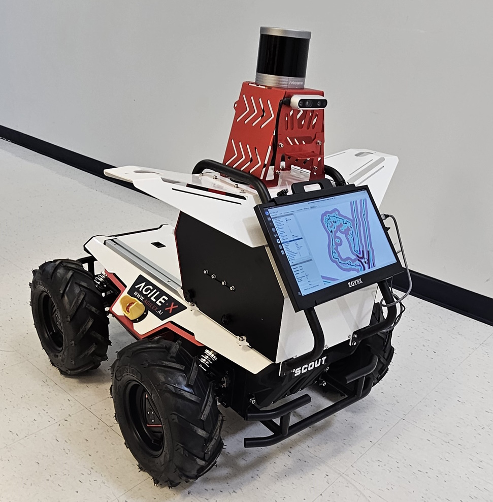

# AgileX_Autonomous_Driving_CU
Using AgileX Robotics' Scout 2.0 and RoboSense LiDAR for autonomous driving

## Research Objective
- Understand how to pair AgileX robtics with ROS to create an Unmanned Ground Vehicle
- Explore methods such as Autoware and Cartography
- Use LiDAR and other sensors to map and navigate indoors and outdoors

## Hardware
### Scout 2.0:
- AgileX Scout 2.0
- Auto Kit
- Nvidia Jetson AGX Orin
- Robosense LiDAR Helios 16

## Software
- [Ubuntu 22.04](https://releases.ubuntu.com/jammy/)
- [ROS2 Humble](https://docs.ros.org/en/humble/index.html)
- [scout_ros2](https://github.com/agilexrobotics/scout_ros2)
- [rslidar_sdk](https://github.com/RoboSense-LiDAR/rslidar_sdk)
- [pointcloud_to_laserscan](https://github.com/ros-perception/pointcloud_to_laserscan)
- [Slam toolbox](https://github.com/SteveMacenski/slam_toolbox)
- [Nav2](https://github.com/ros-navigation/navigation2)

## User Guide

More infomation can be found in [Readme.pdf](Readme.pdf)
